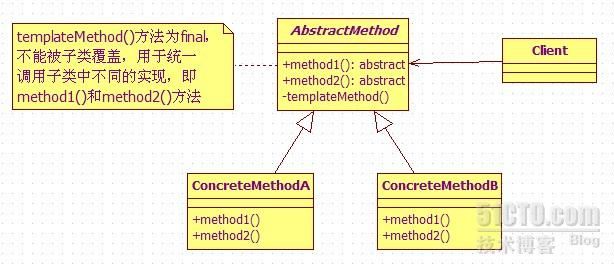

# Java中的"钩子"

最近看银辉大哥写的对hdfs中小文件打包成大文件的程序的时候，发现他在代码中巧妙地运用了“钩子”，是用匿名内部类来实现的，感觉很酷，所以决定好好向大神学习一下使用匿名内部类实现钩子的用法：

#### 题目

为了让我能够快速了解这个方法的使用，银辉大哥首先给我出个题：
比如上医院看病，一般会有　挂号，问诊，开药，付费，拿药　几个过程，但是不同的病科室不同，大夫不同，药方不同，付费方式不同，取药方式不同。写一个程序，打印不同的看病流程：如一个人感冒：挂呼吸科，看张大夫，开了砒霜，支付宝支付，快递拿药。
另外一个人胃痛，挂了内科，看了王大夫，开了鹤顶红，没有付钱，直接抢药。

#### 模板方法

模板方法模式（Template Method）：定义一个操作中的算法的骨架，而将一些步骤延迟到子类中。该模式使得子类可以不改变一个算法的结构即可重定义该算法的某些特定步骤。
使用场景：
1、一次性实现一个算法的不变的部分，并将可变的行为留给子类来实现。
2、各子类中公共的行为应被提取出来并集中到一个公共父类中以避免代码重复。即“重分解以一般化”，首先识别现有代码中的不同之处，并且将不同之处分离为新的操作。最后，用一个调用这些新的操作的模板方法来替换这些不同的代码。
3、控制子类扩展。模板方法只在特定点调用“Hook Method（钩子方法）”操作，这样就只允许在这些点进行扩展。

#### 实现代码

##### interface GoHospital.java:

	/**
	 * Created by Adam on 2016/5/27.
	 */
	public interface GoHospital extends Runnable{
	    /**
	     * 挂号
	     * @return 科室名
	     */
	    void onRegister(ActionHook register);

	    /**
	     * 问诊
	     * @return 病名
	     */
	    void onInterview(ActionHook interview);

	    /**
	     * 开药
	     * @return 药名
	     */
	    void onMedicine(ActionHook medicine);

	    /**
	     * 付费
	     * @return 付了多少钱
	     */
	    void onPay(ActionHook pay);

	    /**
	     * 返回取药方式
	     * @return 取药方式
	     */
	    void onGetMedicine(ActionHook getMedicine);

	}

###### AbsGoHospital.java

	/**
	 * Created by Adam on 2016/5/27.
	 */
	abstract class AbsGoHospital implements GoHospital{
	    private ActionHook register;
	    private ActionHook intterview;
	    private ActionHook medicine;
	    private ActionHook pay;
	    private ActionHook getMedicine;

	    public void run(){
	        if (register != null) {
	            boolean isRegisterOk = register.exec();
	            if (isRegisterOk && intterview != null) {
	                boolean isIntterviewOk = intterview.exec(isRegisterOk);
	                if (isIntterviewOk && medicine != null) {
	                    boolean isMedicineOK = medicine.exec();
	                    if (isMedicineOK && pay != null) {
	                        boolean isPayOk = pay.exec();
	                        if (isPayOk && getMedicine != null) {
	                            boolean isGetMedicineOk = getMedicine.exec();
	                        }
	                    }
	                }
	            }
	        }

	    }

	    /**
	     * 挂号
	     * @return 科室名
	     */
	    public void onRegister(ActionHook register) {
	        this.register = register;
	    }

	    /**
	     * 问诊
	     * @return 病名
	     */
	    public void onInterview(ActionHook interview) {
	        this.intterview = interview;
	    }

	    /**
	     * 开药
	     * @return 药名
	     */
	    public void onMedicine(ActionHook medicine) {
	        this.medicine = medicine;
	    }

	    /**
	     * 付费
	     * @return 付了多少钱
	     */
	    public void onPay(ActionHook pay) {
	        this.pay = pay;
	    }

	    /**
	     * 返回取药方式
	     * @return 取药方式
	     */
	    public void onGetMedicine(ActionHook getMedicine) {
	        this.getMedicine = getMedicine;
	    }

	}

###### 定义一个钩子

	/**
	 * Created by Adam on 2016/5/27.
	 */
	public interface ActionHook {
	    /**
	     * 钩子逻辑
	     * @param args 任意参数
	     */
	    boolean exec(Object ... args);
	}

###### 定义GoHostpital的实现类

	/**
	 * Created by Adam on 2016/5/27.
	 */
	public class XiaogangGoHopital extends AbsGoHospital {
	    // todo 这里的字段，方法都可以用enum扩展，由于本例为了学习，所以略过
	    private String name;
	    private String diease;
	    private String paymentPre;
	    private String getMedicineWay;

	    public XiaogangGoHopital(String name, String diease, String paymentPre, String getMedicineWay) {
	        this.name = name;
	        this.diease = diease;
	        this.paymentPre = paymentPre;
	        this.getMedicineWay = getMedicineWay;
	    }

	    @Override
	    public String toString() {
	        return "XiaogangGoHopital{" +
	                "name='" + name + '\'' +
	                ", diease='" + diease + '\'' +
	                ", paymentPre='" + paymentPre + '\'' +
	                ", getMedicineWay='" + getMedicineWay + '\'' +
	                '}';
	    }

	    public String getDiease() {
	        return diease;
	    }

	    public void setDiease(String diease) {
	        this.diease = diease;
	    }

	    public String getPaymentPre() {
	        return paymentPre;
	    }

	    public void setPaymentPre(String paymentPre) {
	        this.paymentPre = paymentPre;
	    }

	    public String getGetMedicineWay() {
	        return getMedicineWay;
	    }

	    public void setGetMedicineWay(String getMedicineWay) {
	        this.getMedicineWay = getMedicineWay;
	    }

	    public String getName() {
	        return name;
	    }

	    public void setName(String name) {
	        this.name = name;
	    }

	    @Override
	    public void onRegister(final ActionHook register) {
	        super.onRegister(new ActionHook() {
	            @Override
	            public boolean exec(Object... args) {
	                register.exec(args);
	                System.out.println(name + "骑电瓶车去的");
	                return true;
	            }
	        });
	    }
	}

###### LiGoHopital 实现类

	/**
	 * Created by Adam on 2016/5/27.
	 */
	public class LiGoHopital extends AbsGoHospital {
	    // todo 这里的字段，方法都可以用enum扩展，由于本例为了学习，所以略过
	    private String name;
	    private String diease;
	    private String paymentPre;
	    private String getMedicineWay;

	    public LiGoHopital(String name, String diease, String paymentPre, String getMedicineWay) {
	        this.name = name;
	        this.diease = diease;
	        this.paymentPre = paymentPre;
	        this.getMedicineWay = getMedicineWay;
	    }

	    @Override
	    public String toString() {
	        return "XiaogangGoHopital{" +
	                "name='" + name + '\'' +
	                ", diease='" + diease + '\'' +
	                ", paymentPre='" + paymentPre + '\'' +
	                ", getMedicineWay='" + getMedicineWay + '\'' +
	                '}';
	    }

	    public String getDiease() {
	        return diease;
	    }

	    public void setDiease(String diease) {
	        this.diease = diease;
	    }

	    public String getPaymentPre() {
	        return paymentPre;
	    }

	    public void setPaymentPre(String paymentPre) {
	        this.paymentPre = paymentPre;
	    }

	    public String getGetMedicineWay() {
	        return getMedicineWay;
	    }

	    public void setGetMedicineWay(String getMedicineWay) {
	        this.getMedicineWay = getMedicineWay;
	    }

	    public String getName() {
	        return name;
	    }

	    public void setName(String name) {
	        this.name = name;
	    }

	    @Override
	    public void onRegister(final ActionHook register) {
	        super.onRegister(new ActionHook() {
	            @Override
	            public boolean exec(Object... args) {
	                register.exec(args);
	                System.out.println(name + "ta开车去的");
	                return true;
	            }
	        });
	    }

	    @Override
	    public void onPay(final ActionHook pay) {
	        super.onPay(new ActionHook() {
	            @Override
	            public boolean exec(Object... args) {
	                pay.exec();
	                System.out.println("他不喜欢付钱");
	                return true;
	            }
	        });
	    }
	}

###### mainz测试函数

	/**
	 * Created by Adam on 2016/5/27.
	 */
	public class Main {
	    public static void main(String[] args) {
	        XiaogangGoHopital xiaogangGoHopital = new XiaogangGoHopital("Gang", "jiba", "zhifubao", "shunfeng");
	        xiaogangGoHopital.onRegister(new ActionHook() {
	            @Override
	            public boolean exec(Object... args) {
	                System.out.println("=====\n外科");
	                return true;
	            }
	        });
	        xiaogangGoHopital.onInterview(new ActionHook() {
	            @Override
	            public boolean exec(Object... args) {
	                System.out.println(args[0]);
	                System.out.println("右臂肌肉损伤");
	                return true;
	            }
	        });
	        xiaogangGoHopital.onMedicine(new ActionHook() {
	            @Override
	            public boolean exec(Object... args) {
	                System.out.println("钙片");
	                return true;
	            }
	        });
	        xiaogangGoHopital.onPay(new ActionHook() {
	            @Override
	            public boolean exec(Object... args) {
	                System.out.println("支付宝付了 123 元");
	                return true;
	            }
	        });
	        xiaogangGoHopital.onGetMedicine(new ActionHook() {
	            @Override
	            public boolean exec(Object... args) {
	                System.out.println("顺风快递");
	                return true;
	            }
	        });

	        Thread thread = new Thread(xiaogangGoHopital);
	        thread.start();

	        LiGoHopital liGoHopital = new LiGoHopital("Li", "jiba", "zhifubao", "shunfeng");
	        liGoHopital.onRegister(new ActionHook() {
	            @Override
	            public boolean exec(Object... args) {
	                System.out.println("=====\n外科");
	                return true;
	            }
	        });
	        liGoHopital.onInterview(new ActionHook() {
	            @Override
	            public boolean exec(Object... args) {
	                System.out.println("右臂肌肉损伤");
	                return true;
	            }
	        });
	        liGoHopital.onMedicine(new ActionHook() {
	            @Override
	            public boolean exec(Object... args) {
	                System.out.println("钙片");
	                return true;
	            }
	        });
	        liGoHopital.onPay(new ActionHook() {
	            @Override
	            public boolean exec(Object... args) {
	                System.out.println("支付宝付了 123 元");
	                return true;
	            }
	        });
	        liGoHopital.onGetMedicine(new ActionHook() {
	            @Override
	            public boolean exec(Object... args) {
	                System.out.println("顺风快递");
	                return true;
	            }
	        });

	        Thread thread2 = new Thread(liGoHopital);
	        thread2.start();

	    }
	}

#### 测试结果

结果如下：

	=====
	外科
	Gang骑电瓶车去的
	true
	右臂肌肉损伤
	钙片
	支付宝付了 123 元
	顺风快递
	=====
	外科
	Lita开车去的
	右臂肌肉损伤
	钙片
	支付宝付了 123 元
	他不喜欢付钱
	顺风快递

#### 总结

由于工作任务蛮重，所以实现地很简单，详细代码可以参考hdfs小文件问题的归档程序；
理解设计模式，或者实现技巧，才是第一步，以后能够把它熟练运用才是最重要的！