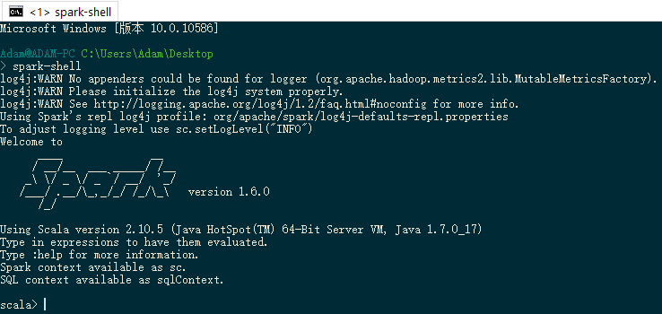

# Windows bash下搭建Spark学习环境
2016.1.29
--------
由于回家需要学习spark，但联网不太方便，装Linux虚拟机又太卡，所以打算在windows本机上搭建一个Spark环境进行学习，经过尝试，终于搭建成功，将心得分享下来，希望对以后需要的同学有用，当然，还是建议在Linux环境下学习使用Spark。

## 本地环境
公司发的Thinkpad T450电脑，windows10(当然win7也应该是没有问题的)64位，4G内存，没有翻墙功能的网络，安装过程中出现了一些资源链接不上的问题，测试并不是因为墙的原因，最终也能安装成功

## 安装步骤

1. 下载[scala](http://www.scala-lang.org/download/)并安装，配置执行文件到系统路径，我下的是最新版本scala-2.11.7；
2. 下载[Spark](http://spark.apache.org/downloads.html)解压到D盘，我下的是最新版本spark-1.6.0.tgz；
3. 下载[windows环境下的sbt](http://www.scala-sbt.org/download.html)，我下的是最新版本sbt-0.13.9.msi，然后按照默认情况按照，安装好之后将sbt的文件复制到spark目录下，覆盖替换原来的sbt版本；
4. 安装[windows版本的git工具](http://git-scm.com/download/win)我下的也是最新版本Git-2.7.0-64-bit.exe,以前旧版本在win10下有bug，安装好后配置环境变量。
5. 建议安装[ConEmu](http://www.fosshub.com/ConEmu.html)，我安装的是最新版本ConEmuPack.150813f.7z，它的作用是可以右键运行类似Linux Shell的环境，因为git bash对spark-shell的支持不好，因此这个工具可以使得学习的时候更加方便；在git中配置对中文的支持，使用
`git config --global core.quotepath false` 命令即可
6. 按照Spark官方的安装指南，在解压的目录下，运行`bin/sbt package`命令，这会将spark所有依赖的lib下载到本地的ivy repository （sbt默认使用ivy repository)
7. 按照Spark官方的安装指南，在解压的目录下，运行`bin/sbt assembly`命令，这会将spark依赖的库和spark本身assemble成一个很大的jar包。 这步完成后，你会在assembly\target\scala-2.10下找到spark-assembly-1.6.0-hadoop2.2.0.jar, spark-assembly_2.10-1.6.0.jar这两个jar包
8. 输入`spark-shell`启动spark-shell 

然后可以配置`D:\spark-1.6.0\bin` 到Path中，就可以在其它文件中直接键入`spark-shell`命令来启动spark-shell了
