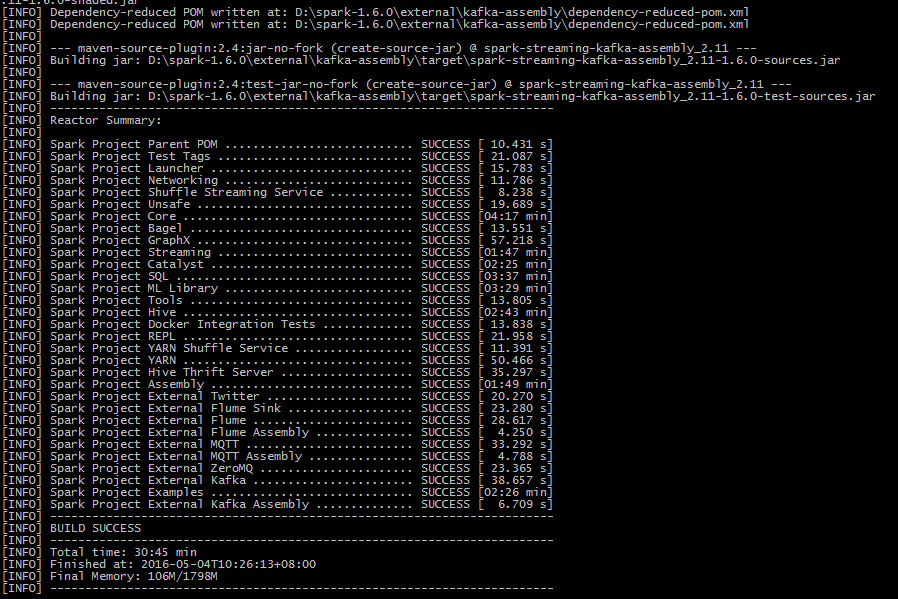

# spark 1.6 yarn1.6 hive版本编译打包
由于直接下载预编译好的spark与我们的集群环境不够符合，因此需要下载源码后本地编译
参考：
http://spark.apache.org/docs/latest/building-spark.html#building-with-buildmvn

### 前提
安装好了3.3.3版本以上的maven 与java7+
最好使用scala 2.10版本，我使用的是scala2.11，退回到scala2.10.6，后来因为之前就是在2.11中开发的，又返回到2.11
我的环境如下

	Apache Maven 3.3.9
	Maven home: D:\ProgramFiles\apache-maven-3.3.9\bin\..
	Java version: 1.7.0_17, vendor: Oracle Corporation
	Java home: C:\Java\jdk1.7.0_75\jre
	Default locale: zh_CN, platform encoding: GBK
	OS name: "windows 8", version: "6.2", arch: "amd64", family: "windows"

#### 1. 下载源代码

http://www.apache.org/dyn/closer.lua/spark/spark-1.6.0/spark-1.6.0.tgz

解压到 `D:\spark-1.6.0`,然后进入这个目录
修改scala版本到2.11

	./dev/change-scala-version.sh 2.11

设置maven的Memory usage

	export MAVEN_OPTS="-Xmx2g -XX:MaxPermSize=512M -XX:ReservedCodeCacheSize=512m"

使用maven编译

	mvn -Pyarn -Phadoop-2.6 -Dhadoop.version=2.6.0 -Phive -Phive-thriftserver -DskipTests clean package

    mvn -Pyarn -Phadoop-2.6 -Dhadoop.version=2.6.0-cdh5.4.7 -Dscala-2.11 -Phive -Phive-thriftserver -DskipTests clean package 
	

44min后 build Success：

