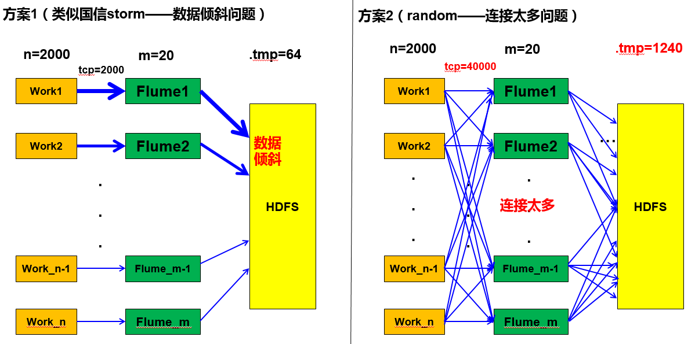
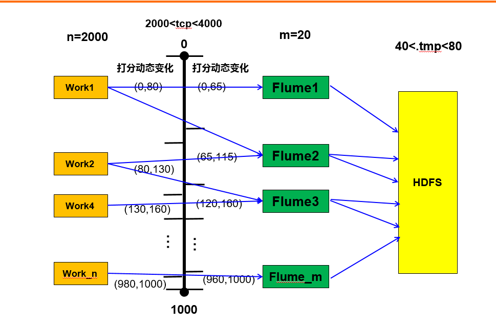
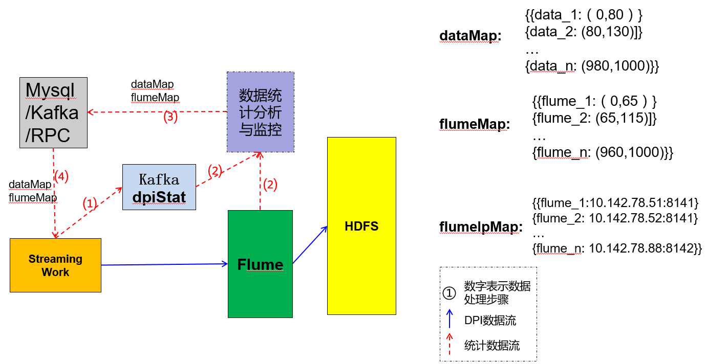

# 基于源数据打分的动态调控算法

王小刚 2016.04.29

-----------
[TOC]

### 算法背景与适用场景

对每天TB级别甚至到PB级别的大量的数据(比如日志数据)进行分析，汇总并最终数据落地是一个非常值得挑战的工程。通常，对如此大的数据量进行比较复杂的分析需要使用实时性和吞吐量都比较高的流式处理工具，比如Storm或者Spark Streaming，为了对在各个节点上处理的数据进行汇总与分发，可以使用flume集群作为汇总落地与分发的管道。由于flume集群的数量与流式处理的节点的数量都非常多，而且有很多不可控的因素，因此如何高效地控制数据流从流式处理节点对flume集群的发送策略举足轻重。

### 算法目标

以Streaming程序对DPI数据汇总（电信各省的上网数据汇总）的数据落地为例，假设目前生产环境中有31个省的数据需要实时落地到不同的目录中去，落地速度为350W条/s，相当于1G/s的速度，每个省的数据速率不同，比如广州省每天的数据量比甘肃省的数据量大很多。假设每个flume agent平均拥有50M/s的数据落地速度，由于客观环境的原因，每个flume的处理数据的能力也有所差别。

为了提高flume的速度，每个flume有16个并发的hdfs sink，也就是说，也就是同一时刻同一目录下，每个flume agent都会打开16个hdfs文件进行写操作。

基于以上假设，算法目标是能够完成这么多数据的落地，并且尽量减少集群压力，没有数据倾斜与同时写文件数过多等问题；

### 简单的实现方案

有两种简单的方法可以实现数据落地，如下图所示，其中work1到flume1抽象地表示省1的数据发送到flume1，然而实际情况是每一个work代表集群中同时处理省1数据的节点群，是随机的：

#### 1. 不同的省份数据对应指定的flume

如上图左所示，该方案比较简单，这样做的问题是：
a. 会出现数据倾斜的情况，比如广东省的数据对应的flume压力太大，而甘肃省对应的flume压力较小;
b. 如果原省份的数据量突然发生变动，就会存在flume无法及时调整的情况。

#### 2. 所有数据随机发送到所有flume

这是一个负载均衡的办法，但是存在以下问题：
a. 网络负载加大。2000个Spark work发送到20个flume，导致网络中同时有 2000*20=40000个TCP-IP链接；
b. flume连接压力增大。每个flume source都会有2000个Spark work与它连接，导致极大地降低flume的性能；
c. hdfs连接压力增大。31个的62个目录下（正确数据目录与错误数据目录），都有20个flume的hdfs sink，同时有 62 * 20 = 1240个文件在写，导致hdfs性能降低。

### 算法介绍
 
为了解决以上问题，本人提出了`基于源数据与Flume进行数据打分的动态调控算法`，以最少的开销与最简单的方案来解决这个问题，请看下面算法介绍：

1. 如上图所示，对每个省的数据发送情况进行动态的打分，假设广东省为data1，河北省为data2，过去的10分钟，所有dpi数据总量为200G，其中广州省数据量为16G，河北省的数据量为10G，则广东省的打分区间长度为 (16/200)*1000=80分，所以广东省打分区间为[0,80)，河北省的打分区间长度为（10/200）*1000=50分，所以河北省的打分区间为[80,130)分。（31个省平均打分区间为1000/31=32.26分）。经过以上计算，可以得到每个省份的打分区间；

2. 同理，对每个flume的处理速率进行动态的打分，假设过去十分钟，总的平均数据处理速度为1G/s，flume1的平均处理速度为65M/s，则flume1的打分区间长度为(65/1000)*1000=65分，打分区间为[0,65),flume2的平均处理速度为50M/s，打分区间为[65,115),(20个flume平均打分区间为50分，一般情况下flume的处理能力都是一样的，所以可以不用动态打分)。经过以上计算，可以得到每个flume的打分区间；

3. 不失一般性，以河北省为例，2000个work中的1个work拿到河北省的数据后，会通过全局变量得到河北省的打分区间[80,130)，然后在这个区间内生成一个随机数，如果这个随机数是属于[65,115)，则这个数据发送到flume2，如果这个随机数属于[115,130)，则数据发送到flume3；

4. 以flume2为例，flume2接收到的数据只有广东省和河北省的数据，其中广东省的数据占30%，河北省的数据占70%，因此会将这两省份的正确数据和错误数据分别写入hdfs对应的文件夹下，文件落地成功。

#### 证明

1. 由于数据条数非常大，所以可以保证打分的随机性；
2. 很容易可以证明，由于每个省的数据量与其打分区间长度成正比，而每个flume的处理能力与其打分区间成正比，因此可以得出，每个flume接收到的数据都是负载均衡的，如果flume分散在集群中的话，hdfs就不会出现数据倾斜的问题；
3. 由上图可以看出，对于数据量大于50M/s的省，由于其打分区间是连续的，它的数据可以保证只发送给不超过3台flume；数据量小于50M/s的省，可以保证发送不超过2个flume；对于每个flume，一般也只接收3个以内的省份数据。

由上所述，数据非常平衡，连接数量也接近最小。

#### 算法复杂度：
       时间复杂度O（1），空间复杂度O（1），与数据量的大小以及work的数量无关。
       并且，此算法可能可以宏观动态地实现flume的灾备，当一个flume发生错误崩溃后，可以直接调整flumeMap导致原来发送到改flume的数据平均分配到其它的flume中去。

#### 实现方案

如上图所示：

1. 上图的(1),(2),(2)步骤另外一个独立的数据统计与分析监控的程序从kafka读取dpiStat消息，通过对消息进行分析汇总，得到一段时间内的总数据量与各个省的数据量，通过之前所说的方法计算出dataMap的Json格式数据，同时通过对flume的监控，得到flumeMap的Json监控数据；
将dataMap数据与flumeMap数据发送给StreamingWorker；
2. 数据发送方式有很多种， 
a. 将统计数据实时更新到MySQL数据库，然后Streaming程序隔一段时间读取改数据库，然后通过广播变量告知所有的SteamingWorker；
b. 也可以通过kafka消息与Streaming程序进行数据交互，或直接通过RPC协议与Worker进行交互。

3. StreamingWorker得到dataMap数据后，通过输入数据的省份信息得到一个随机打分值，然后将这个值得到flumeMap所对应的flume的IP地址，最终发送数据给对应的flume。

### 问题讨论：
上述算法还是比较清晰简单的，也具有一定的可行性，但也有一些问题需要讨论

1. flume的应该尽量在hdfs的网络拓扑中均匀分布；
2. 可以在Spark中用scala实现Map消息定期的获取，通过广播变量让每个worker拿到统一的全局Map数据。也可以使用每个worker单独地读取Map信息，信息可能不同步。这两者之间如何选择；
3. 数据统计分析与监控模块可以使用单独的MVC模式实现，也可以集成到监控框架中；
4. 监控程序与Spark集群中间通信方式的选择，可以考虑MySQL实现定时存取，也可以使用kafka的生产消费模式，也可以直接进行实时的RPC通信，该如何选择。
5. 打分区间顺序的问题，可以考虑对各个省份通过数据量大小排序，这样可以达到最少的连接数，但是顺序不稳定，也可以一开始定一个固定的顺序。

该问题的提出完全基于个人的理解与假设，希望大家能够提出我还没有考虑到的问题，给予建议。
 